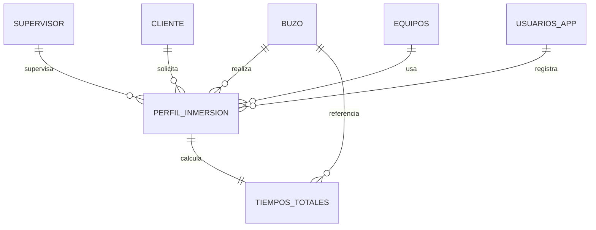

# MDIBUCEO — Documentación del proyecto

Bitácora de inmersiones para MDI Buceo (Puerto Varas, Chile). App web responsive para registrar inmersiones y mantener los catálogos de buzos, equipos, supervisores y clientes, con control de acceso por roles.

## 1. Resumen ejecutivo

| | |
|---|---|
| **Nombre app** | MDIBUCEO |
| **Repositorio** | github.com/micartesr/inmersion |
| **Carpeta local** | `~/Downloads/Claude_2026/inmersion` |
| **Base de datos** | Supabase (Postgres) — proyecto `mdibuceo`, región `sa-east-1` |
| **Hosting** | Vercel — proyecto `mdibuceo`, team `micartesr-3914s-projects` |
| **Stack** | Vite + React 18 + TypeScript + Tailwind CSS + Supabase JS |
| **Auth** | Supabase Auth (email/password) con roles: `admin`, `supervisor`, `lectura` |

## 2. Stack tecnológico

- **Frontend:** Vite, React 18, TypeScript, React Router 6, Tailwind CSS.
- **Backend:** Supabase (Postgres 17, Auth, RLS, PostgREST autogenerado). Sin backend propio — el cliente habla directo con Supabase, protegido por Row Level Security.
- **Validación:** Zod en el cliente + `CHECK` constraints en la base de datos como segunda barrera.
- **Hosting:** Vercel, SPA estática con rewrite a `index.html` (`vercel.json`) para que funcione el ruteo de React Router.

## 3. Estructura de carpetas

```
inmersion/
├── index.html
├── package.json
├── vite.config.ts
├── tailwind.config.js
├── postcss.config.js
├── tsconfig.json
├── vercel.json
├── .env.example
└── src/
    ├── main.tsx              # entry point, providers (Router, AuthProvider)
    ├── App.tsx                # definición de rutas
    ├── index.css              # tema Tailwind + clases utilitarias (.card, .btn-primary, etc.)
    ├── lib/
    │   ├── supabaseClient.ts  # cliente Supabase (URL + anon key)
    │   ├── types.ts           # tipos TS generados/alineados al esquema
    │   ├── auth.tsx           # AuthProvider + hook useAuth (sesión, rol, esAdmin, esEditor)
    │   ├── useCrud.ts         # hook genérico para list/insert/update/delete por tabla
    │   ├── validators.ts      # esquemas Zod por formulario
    │   └── format.ts          # helpers (RUT, fechas, cálculo de minutos entre horas)
    ├── components/
    │   ├── Layout.tsx         # sidebar desktop / tab bar mobile + navegación pill
    │   ├── Logo.tsx           # ícono original inspirado en máscara de buceo
    │   ├── ProtectedRoute.tsx # exige sesión activa; RoleGate exige rol
    │   ├── DataTable.tsx      # tabla responsive reutilizable
    │   ├── FormField.tsx      # input/select/textarea con label + error
    │   ├── Badge.tsx          # estados (activo/inactivo, vencimientos)
    │   ├── StatTile.tsx       # tarjetas KPI del dashboard
    │   ├── EmptyState.tsx     # estado vacío (ilustración + CTA)
    │   └── Modal.tsx          # confirmaciones (ej. eliminar registro)
    └── pages/
        ├── Login.tsx
        ├── Dashboard.tsx           # "Resumen"
        ├── Inmersiones.tsx         # listado + filtros
        ├── NuevaInmersion.tsx      # alta/edición de inmersión + tiempos totales
        ├── DetalleInmersion.tsx    # ficha de una inmersión
        ├── Usuarios.tsx            # panel admin: asignar roles
        └── mantenedores/
            ├── Buzos.tsx
            ├── Equipos.tsx
            ├── Supervisores.tsx
            └── Clientes.tsx
```

## 4. Modelo de datos

Base `mdibuceo` en Supabase, esquema `public`, con Row Level Security activada en **todas** las tablas.

### 4.1 Catálogos (maestros)

**`buzo`**
| columna | tipo | notas |
|---|---|---|
| id_buzo | uuid PK | `gen_random_uuid()` |
| rut_buzo | text | `UNIQUE`, `NOT NULL` |
| nombre_buzo | text | `NOT NULL` |
| clase_matricula | text | |
| vencimiento_hipervarico | date | |
| estado | text | `CHECK IN ('activo','inactivo','suspendido')`, default `'activo'` |
| created_at / updated_at | timestamptz | trigger automático |

**`equipos`**
| columna | tipo | notas |
|---|---|---|
| numero_serie_ordenador | text PK | |
| tipo_equipo_buceo | text | `NOT NULL` |
| matricula_equipo | text | |
| vencimiento_equipo | date | |

**`supervisor`**
| columna | tipo | notas |
|---|---|---|
| id_supervisor | uuid PK | |
| rut_super | text | `UNIQUE`, `NOT NULL` |
| nombre_super | text | `NOT NULL` |

**`cliente`**
| columna | tipo | notas |
|---|---|---|
| id_cliente | uuid PK | |
| nombre_cliente | text | `NOT NULL` |
| observacion | text | |

### 4.2 Transaccionales

**`perfil_inmersion`** — evento de inmersión. El pedido original no traía llaves foráneas explícitas; se agregaron para integridad referencial real:
| columna | tipo | notas |
|---|---|---|
| id_inmersion | uuid PK | |
| fecha_inmersion | date | `NOT NULL` |
| hora_dejo_superficie / hora_llego_fondo / hora_dejo_fondo / hora_llego_superficie | time | `CHECK` de orden cronológico entre sí |
| id_buzo | uuid | FK → `buzo`, `NOT NULL`, `ON DELETE RESTRICT` |
| id_supervisor | uuid | FK → `supervisor`, `ON DELETE RESTRICT` |
| id_cliente | uuid | FK → `cliente`, `ON DELETE RESTRICT` |
| numero_serie_ordenador | text | FK → `equipos`, `ON DELETE RESTRICT` |
| ubicacion, temperatura_agua, estado_mar, faena_realizada | — | campos adicionales tomados del diseño de referencia |
| created_by | uuid | FK → `usuarios_app` |

**`tiempos_totales`** — 1:1 con `perfil_inmersion`:
| columna | tipo | notas |
|---|---|---|
| id_inmersion | uuid PK/FK | → `perfil_inmersion`, `ON DELETE CASCADE` |
| id_buzo | uuid | FK → `buzo`; un trigger (`check_tiempos_totales_buzo`) obliga a que coincida con el buzo de la inmersión asociada |
| tiempo_total_fondo, tiempo_total_descompresion, tiempo_total_buceo | integer (minutos) | `CHECK >= 0` |
| profundidad_maxima | numeric | `CHECK >= 0` |
| tabulacion | text | |

### 4.3 Seguridad de acceso

**`usuarios_app`** — perfil de aplicación 1:1 con `auth.users` de Supabase:
| columna | tipo | notas |
|---|---|---|
| id | uuid PK/FK | → `auth.users`, `ON DELETE CASCADE` |
| nombre | text | |
| rol | enum `user_role` | `admin` \| `supervisor` \| `lectura`, default `lectura` |
| activo | boolean | default `true` |

Un trigger (`handle_new_user`) crea automáticamente la fila en `usuarios_app` con rol `lectura` apenas alguien se registra — nadie puede auto-asignarse un rol mayor.

### 4.4 Diagrama de relaciones



## 5. Seguridad (Row Level Security)

Ninguna tabla es accesible sin sesión válida — no hay acceso anónimo a datos.

| Tabla | SELECT | INSERT / UPDATE | DELETE |
|---|---|---|---|
| `buzo`, `equipos`, `supervisor`, `cliente` | usuario activo | `admin` o `supervisor` | solo `admin` |
| `perfil_inmersion`, `tiempos_totales` | usuario activo | `admin` o `supervisor` | solo `admin` |
| `usuarios_app` | propia fila, o todas si `admin` | `admin` únicamente | solo `admin` |

Implementado con funciones `SECURITY DEFINER` (`is_active_user()`, `is_editor()`, `is_admin()`) para evitar recursión de RLS. Se corrigieron los warnings del linter de seguridad de Supabase (`search_path` fijo en funciones trigger, `handle_new_user` sin acceso público por RPC). Los únicos warnings restantes son intencionales: las funciones helper de rol deben ser ejecutables por `authenticated`/`anon` para que las políticas RLS funcionen; solo devuelven un booleano sobre la sesión propia, no exponen datos.

La **anon/publishable key** de Supabase está pensada para ser pública — la protección real vive en RLS, no en ocultar esa key. La `service_role key` nunca se usa en el cliente.

## 6. Variables de entorno

```
VITE_SUPABASE_URL=https://ozwbhpdulgibbvtzzydl.supabase.co
VITE_SUPABASE_ANON_KEY=sb_publishable_7pRmUcsISDqelf4Bow96rw_GM5d0jtw
```

Ya están como valores por defecto en `src/lib/supabaseClient.ts`, así que el build funciona igual sin configurarlas en Vercel. `.env.example` documenta el formato por si se prefiere sobreescribirlas.

## 7. Mapa de pantallas

| Ruta | Pantalla | Acceso |
|---|---|---|
| `/login` | Inicio de sesión / registro | público |
| `/` | Resumen (KPIs: inmersiones del mes, buzos activos, vencimientos próximos) | usuario activo |
| `/inmersiones` | Listado y filtros | usuario activo |
| `/inmersiones/nueva` | Registrar inmersión | `admin` / `supervisor` |
| `/inmersiones/:id` | Detalle de inmersión | usuario activo |
| `/inmersiones/:id/editar` | Editar inmersión | `admin` / `supervisor` |
| `/mantenedores/buzos` | CRUD de buzos | lectura para todos, escritura `admin`/`supervisor` |
| `/mantenedores/equipos` | CRUD de equipos | ídem |
| `/mantenedores/supervisores` | CRUD de supervisores | ídem |
| `/mantenedores/clientes` | CRUD de clientes | ídem |
| `/usuarios` | Asignar roles a usuarios | solo `admin` |

## 8. Sistema de diseño

Réplica del artefacto de referencia: tema oscuro náutico.

| Token | Valor | Uso |
|---|---|---|
| `navy-950` | `#0a141c` | fondo general |
| `navy-900` | `#0f1b24` | fondo de tarjetas |
| `navy-700` | `#1c2f3a` | bordes |
| `coral-500` | `#e8794f` | acciones primarias, tab activo |
| `amber-400` | `#d9a84e` | labels tipo "eyebrow" (mayúsculas, monoespaciado) |

Tipografía: system-ui sans para texto general, monoespaciada para etiquetas de sección. Radios grandes (tarjetas `1.25rem`, botones tipo pill totalmente redondeados). El logo es un ícono original inspirado en máscara de buceo (no una copia del artwork del artefacto, por política de derechos de autor).

## 9. Despliegue

### 9.1 Supabase — ✅ hecho
- Proyecto `mdibuceo` (`ozwbhpdulgibbvtzzydl`) activo en `sa-east-1`, plan free.
- Migraciones aplicadas: extensiones/roles, catálogos, tablas transaccionales, políticas RLS, fix de advisors.

### 9.2 GitHub — ⏳ pendiente de tu lado
Repo `github.com/micartesr/inmersion` ya existe. El código está commiteado localmente con el remote configurado. Este entorno no tiene credenciales de GitHub, así que falta correr desde tu Terminal:
```bash
cd ~/Downloads/Claude_2026/inmersion
git push -u origin main
```

### 9.3 Vercel — ⏳ pendiente de tu lado
El deploy vía API quedó publicado pero detrás del muro **"Vercel Authentication"** (SSO), y las herramientas de gestión de este entorno no logran leer/modificar el proyecto en tu cuenta (bug de permisos entre el token de deploy y el de administración de esta integración). Camino recomendado — Vercel CLI desde tu Terminal:
```bash
cd ~/Downloads/Claude_2026/inmersion
npm install
npx vercel login
npx vercel --prod
```
Alternativa: entrar a vercel.com → proyecto `mdibuceo` → Settings → Deployment Protection → desactivar "Vercel Authentication".

## 10. Puesta en marcha — primer administrador

1. Alguien entra a la app y se registra (crea cuenta con email/password). Automáticamente queda con rol `lectura`.
2. Se me indica el email usado.
3. Se ejecuta una sola vez en Supabase:
   ```sql
   update public.usuarios_app set rol = 'admin' where id = (
     select id from auth.users where email = 'correo@ejemplo.com'
   );
   ```
4. Desde ahí, ese usuario admin puede promover a otros desde `/usuarios`.

## 11. Pendientes

- [ ] `git push` a GitHub (paso 9.2).
- [ ] Desbloquear acceso público en Vercel (paso 9.3).
- [ ] Registrar el primer usuario y promoverlo a `admin` (paso 10).
- [ ] Prueba end-to-end: login, CRUD de cada mantenedor, registro de inmersión completo, verificar que un usuario `lectura` no pueda escribir.

## 12. Diccionario de datos

Detalle columna por columna de las 7 tablas de `mdibuceo` (esquema `public`). PK = llave primaria, FK = llave foránea.

### usuarios_app
| Columna | Tipo | Nulo | Clave | Descripción |
|---|---|---|---|---|
| id | uuid | No | PK / FK → auth.users | Identificador del usuario, igual al de Supabase Auth |
| nombre | text | No | | Nombre visible del usuario (se autocompleta desde el email al registrarse) |
| rol | user_role (enum) | No | | `admin` \| `supervisor` \| `lectura`. Default `lectura`; solo un admin puede subirlo |
| activo | boolean | No | | Si es `false`, el usuario pierde todo acceso a los datos (RLS lo bloquea) sin borrar su cuenta |
| created_at | timestamptz | No | | Fecha de creación del perfil |
| updated_at | timestamptz | No | | Se actualiza automáticamente en cada cambio |

### buzo
| Columna | Tipo | Nulo | Clave | Descripción |
|---|---|---|---|---|
| id_buzo | uuid | No | PK | Identificador interno del buzo |
| rut_buzo | text | No | UNIQUE | RUT chileno del buzo, único en el sistema |
| nombre_buzo | text | No | | Nombre completo |
| clase_matricula | text | Sí | | Clase de matrícula de buceo (ej. "Primera", "Segunda") |
| vencimiento_hipervarico | date | Sí | | Fecha de vencimiento del examen/certificado hiperbárico |
| estado | text | No | CHECK | `activo` \| `inactivo` \| `suspendido`. Default `activo` |
| created_at / updated_at | timestamptz | No | | Trazabilidad automática |

### equipos
| Columna | Tipo | Nulo | Clave | Descripción |
|---|---|---|---|---|
| numero_serie_ordenador | text | No | PK | N° de serie del computador de buceo; identificador natural del equipo |
| tipo_equipo_buceo | text | No | | Tipo de equipo (ej. "Semi-autónomo", "Autónomo", "Superficie") |
| matricula_equipo | text | Sí | | Matrícula/registro oficial del equipo |
| vencimiento_equipo | date | Sí | | Fecha de vencimiento de certificación/mantención |
| created_at / updated_at | timestamptz | No | | Trazabilidad automática |

### supervisor
| Columna | Tipo | Nulo | Clave | Descripción |
|---|---|---|---|---|
| id_supervisor | uuid | No | PK | Identificador interno del supervisor |
| rut_super | text | No | UNIQUE | RUT del supervisor |
| nombre_super | text | No | | Nombre completo |
| created_at / updated_at | timestamptz | No | | Trazabilidad automática |

### cliente
| Columna | Tipo | Nulo | Clave | Descripción |
|---|---|---|---|---|
| id_cliente | uuid | No | PK | Identificador interno del cliente/mandante |
| nombre_cliente | text | No | | Razón social o nombre del cliente |
| observacion | text | Sí | | Notas libres sobre el cliente |
| created_at / updated_at | timestamptz | No | | Trazabilidad automática |

### perfil_inmersion
| Columna | Tipo | Nulo | Clave | Descripción |
|---|---|---|---|---|
| id_inmersion | uuid | No | PK | Identificador de la inmersión |
| fecha_inmersion | date | No | | Fecha en que se realizó la inmersión |
| hora_dejo_superficie | time | Sí | | Hora en que el buzo deja la superficie |
| hora_llego_fondo | time | Sí | | Hora en que el buzo llega al fondo |
| hora_dejo_fondo | time | Sí | | Hora en que el buzo deja el fondo |
| hora_llego_superficie | time | Sí | | Hora en que el buzo llega de vuelta a superficie |
| id_buzo | uuid | No | FK → buzo | Buzo que realizó la inmersión |
| id_supervisor | uuid | Sí | FK → supervisor | Supervisor a cargo |
| id_cliente | uuid | Sí | FK → cliente | Cliente/mandante de la faena |
| numero_serie_ordenador | text | Sí | FK → equipos | Equipo/computador de buceo usado |
| ubicacion | text | Sí | | Lugar geográfico de la inmersión |
| temperatura_agua | numeric(4,1) | Sí | | Temperatura del agua en °C |
| estado_mar | text | Sí | | Condición del mar al momento de la inmersión |
| faena_realizada | text | Sí | | Descripción libre del trabajo realizado |
| created_by | uuid | Sí | FK → usuarios_app | Usuario de la app que registró la inmersión |
| created_at / updated_at | timestamptz | No | | Trazabilidad automática |

Regla adicional: `CHECK` de orden cronológico — dejó superficie ≤ llegó fondo ≤ dejó fondo ≤ llegó superficie (cuando esos valores existen).

### tiempos_totales
| Columna | Tipo | Nulo | Clave | Descripción |
|---|---|---|---|---|
| id_inmersion | uuid | No | PK / FK → perfil_inmersion | Relación 1:1 con la inmersión; se borra en cascada si se borra la inmersión |
| id_buzo | uuid | No | FK → buzo | Debe coincidir con el buzo de `perfil_inmersion` (validado por trigger) |
| tiempo_total_fondo | integer | Sí | CHECK ≥ 0 | Minutos totales en el fondo |
| tiempo_total_descompresion | integer | Sí | CHECK ≥ 0 | Minutos totales de descompresión |
| tiempo_total_buceo | integer | Sí | CHECK ≥ 0 | Minutos totales de buceo (superficie a superficie) |
| profundidad_maxima | numeric(5,1) | Sí | CHECK ≥ 0 | Profundidad máxima alcanzada, en metros |
| tabulacion | text | Sí | | Tabla de descompresión usada (ej. "US Navy") |
| created_at / updated_at | timestamptz | No | | Trazabilidad automática |

## 13. Manual de usuario

### 13.1 Roles y qué puede hacer cada uno
| Rol | Puede |
|---|---|
| lectura | Ver el resumen, el listado de inmersiones y todos los mantenedores. No puede crear ni editar nada |
| supervisor | Todo lo de lectura, más: crear/editar inmersiones y crear/editar registros en los mantenedores |
| admin | Todo lo de supervisor, más: eliminar registros y asignar roles en "Usuarios" |

Todo usuario nuevo entra como `lectura` por defecto; un administrador debe subirle el rol manualmente desde `/usuarios`.

### 13.2 Iniciar sesión / registrarse
1. Entra a la URL de la app.
2. Si es tu primera vez, usa la opción de registro con tu correo y una contraseña.
3. Si ya tienes cuenta, inicia sesión normalmente.
4. Si acabas de registrarte, avisa a un administrador para que te asigne el rol correspondiente (por defecto quedas en solo lectura).

### 13.3 Resumen (pantalla principal)
Muestra los indicadores clave: inmersiones del mes, buzos activos, y próximos vencimientos (certificados hiperbáricos de buzos y de equipos).

### 13.4 Registrar una inmersión
1. Ve a **Inmersiones → Nueva inmersión** (requiere rol `supervisor` o `admin`).
2. Completa **Identificación**: fecha, buzo, ubicación.
3. Completa **Perfil de la inmersión**: profundidad máxima y las 4 horas (dejó superficie, llegó fondo, dejó fondo, llegó superficie). El sistema valida que estén en orden cronológico.
4. Completa **Tiempos totales**: tiempo en fondo, descompresión y buceo total (en minutos).
5. Completa **Condiciones**: temperatura del agua y estado del mar.
6. Completa **Equipo**: número de serie del ordenador y tipo de equipo utilizado.
7. Completa **Tabulación y faena realizada**: tabla de descompresión usada y descripción del trabajo.
8. Presiona **Registrar inmersión**.

### 13.5 Consultar y editar inmersiones
- **Inmersiones** muestra el listado completo con filtros (por fecha, buzo, cliente).
- Haz clic en una fila para ver el detalle completo.
- Con rol `supervisor` o `admin` aparece el botón **Editar**; con rol `admin` también aparece **Eliminar**.

### 13.6 Mantenedores (Buzos, Equipos, Supervisores, Clientes)
Cada mantenedor sigue el mismo patrón:
- **Listar:** todos los usuarios activos pueden ver la tabla completa.
- **Crear:** botón "+ Nuevo" (solo `supervisor`/`admin`), completa el formulario y guarda.
- **Editar:** clic en el lápiz de la fila (solo `supervisor`/`admin`).
- **Eliminar:** clic en el ícono de basurero (solo `admin`). Si el registro está en uso por alguna inmersión, el sistema **impide el borrado** para no perder integridad histórica — en ese caso, cambia su `estado` a inactivo en vez de eliminarlo (aplica sobre todo a Buzos).

### 13.7 Gestión de usuarios (solo admin)
En `/usuarios`, un administrador ve todos los usuarios registrados y puede:
- Cambiar el rol de cualquier usuario (`lectura` ↔ `supervisor` ↔ `admin`).
- Desactivar un usuario (`activo = false`) para revocarle el acceso sin borrar su cuenta.

### 13.8 Uso en celular y tablet
La app es responsive: en pantallas angostas la navegación pasa de barra lateral a barra inferior de pestañas, y las tablas se adaptan a formato de tarjetas apilables para no requerir scroll horizontal.

### 13.9 Preguntas frecuentes
| Problema | Causa / solución |
|---|---|
| "No tienes permiso para acceder a esta sección" | Tu rol es `lectura`. Pide a un admin que te suba a `supervisor` en /usuarios |
| No puedo borrar un buzo/equipo | Tiene inmersiones asociadas; la base de datos protege ese historial. Marca el registro como inactivo en vez de borrarlo |
| Recién me registré y no veo nada editable | Es esperado: todo usuario nuevo parte en `lectura`. Pide que te asignen rol |
| Error de horas en el formulario de inmersión | Las 4 horas deben ir en orden: dejó superficie ≤ llegó fondo ≤ dejó fondo ≤ llegó superficie |

## 14. Manual de configuración

### 14.1 Requisitos previos
- Node.js 18+ y npm (para correr o compilar el proyecto localmente).
- Cuenta de GitHub con acceso al repo `micartesr/inmersion`.
- Cuenta de Vercel (team `micartesr-3914s-projects`).
- Cuenta de Supabase (organización `Home`, proyecto `mdibuceo`).

### 14.2 Correr el proyecto en local
```bash
cd ~/Downloads/Claude_2026/inmersion
npm install
npm run dev
```
Abre la URL que imprime Vite (por defecto `http://localhost:5173`). No necesitas configurar variables de entorno: la URL y la anon key de Supabase ya vienen por defecto en `src/lib/supabaseClient.ts`.

### 14.3 Variables de entorno (opcional)
Si prefieres no depender de los valores por defecto, crea un archivo `.env.local` (nunca se sube a git) a partir de `.env.example`:
```
VITE_SUPABASE_URL=https://ozwbhpdulgibbvtzzydl.supabase.co
VITE_SUPABASE_ANON_KEY=sb_publishable_7pRmUcsISDqelf4Bow96rw_GM5d0jtw
```

### 14.4 Publicar en GitHub
```bash
cd ~/Downloads/Claude_2026/inmersion
git push -u origin main
```
El remote `origin` ya apunta a `https://github.com/micartesr/inmersion.git`. Requiere que tu Terminal tenga sesión de GitHub (Personal Access Token o `gh auth login`).

### 14.5 Publicar en Vercel
```bash
cd ~/Downloads/Claude_2026/inmersion
npx vercel login
npx vercel --prod
```
Si el proyecto queda detrás de un muro de acceso, entra a **vercel.com → proyecto mdibuceo → Settings → Deployment Protection** y desactiva "Vercel Authentication" para que sea público.

### 14.6 Administrar la base de datos (Supabase)
- **Dashboard:** app.supabase.com → proyecto `mdibuceo` (ref `ozwbhpdulgibbvtzzydl`).
- **SQL Editor:** para correr consultas puntuales o nuevas migraciones.
- **Table Editor:** para revisar/editar datos manualmente.
- **Authentication → Users:** para ver o eliminar cuentas de acceso.

### 14.7 Crear el primer administrador
1. Que alguien se registre en la app (queda con rol `lectura`).
2. En el SQL Editor de Supabase, ejecutar una sola vez:
```sql
update public.usuarios_app set rol = 'admin' where id = (
  select id from auth.users where email = 'correo@ejemplo.com'
);
```
3. Desde ese momento, esa persona administra roles desde `/usuarios` sin volver a tocar SQL.

### 14.8 Agregar nuevas columnas o tablas (migraciones)
1. Escribir el SQL de la migración (DDL) con nombre descriptivo en snake_case.
2. Aplicarla contra el proyecto `mdibuceo`.
3. Revisar advisors de seguridad y performance; corregir cualquier warning nuevo.
4. Si agrega una tabla nueva: `alter table ... enable row level security;` y sus policies correspondientes — sin RLS, PostgREST la deja inaccesible por defecto (fail-safe), pero hay que agregarla explícitamente a las policies para que sea usable.

### 14.9 Seguridad y rotación de claves
- La **anon/publishable key** es segura de exponer en el frontend; si se filtra la **service_role key** (nunca debería usarse en el cliente), rotarla de inmediato desde Supabase → Settings → API.
- Revisar periódicamente los advisors de seguridad tras cualquier cambio de esquema.
- Los roles de acceso (`admin`/`supervisor`/`lectura`) son la única forma de otorgar permisos de escritura; nunca dar la service_role key a usuarios finales.

### 14.10 Respaldo de datos
Supabase mantiene backups automáticos diarios en el plan free (retención limitada). Para un respaldo manual on-demand: Supabase Dashboard → Database → Backups, o `pg_dump` contra la connection string del proyecto.

### 14.11 Checklist de troubleshooting
| Síntoma | Revisar |
|---|---|
| La app no carga datos / pantalla en blanco | Consola del navegador; confirmar que `VITE_SUPABASE_URL`/`ANON_KEY` sean correctas |
| "row-level security policy" al guardar | El usuario no tiene el rol necesario (`supervisor`/`admin`) o su fila en `usuarios_app` tiene `activo = false` |
| No puedo desplegar a Vercel | Confirmar sesión con `npx vercel login`; revisar Deployment Protection si la URL pide autenticación |
| `git push` pide usuario/clave | Configurar un Personal Access Token de GitHub o `gh auth login` |

---

## 15. Cambios versión 1.2.0 (Fase 3)

Donde esta sección contradiga a las anteriores, manda esta.

### 15.1 Tabla US Navy: ahora es un mantenedor
Se recreó **vacía** con solo `id_navy`, `composicion` y `observacion`, administrable desde `/mantenedores/tabla-us-navy`. Lo que se cargue ahí es exactamente lo que aparece en el desplegable "Tabulación Tabla US Navy" al registrar una inmersión; si está vacío, el formulario lo advierte. Al vaciar el catálogo se perdió la tabulación asociada a una de las 3 inmersiones históricas (consecuencia esperada).

### 15.2 La tabulación se guarda en la inmersión
El campo pasó de `tiempos_totales.id_navy` a **`perfil_inmersion.id_navy`** (FK → `tabla_us_navy`, `ON DELETE RESTRICT`), que es donde se selecciona en la interfaz. La composición no se duplica como texto: se lee por la relación.

### 15.3 Mantenedor de buzos: correo y habilitación
| Columna nueva | Tipo | Descripción |
|---|---|---|
| email | text (único, case-insensitive) | Correo con el que el buzo creará su cuenta |
| habilitado | boolean NOT NULL default false | Todo buzo nuevo nace deshabilitado |

Flujo: admin/supervisor carga al buzo con su correo → queda deshabilitado → lo habilita desde el botón de la tabla → recién ahí el buzo puede crear cuenta. No se puede habilitar un buzo sin correo registrado.

### 15.4 Registro de cuentas controlado
| Situación | Resultado |
|---|---|
| Correo de buzo habilitado | Crea la cuenta ligada a su ficha, rol buzo, activa |
| Correo de buzo NO habilitado | "Tu ficha de buzo existe pero aún no está habilitada..." |
| Correo no registrado como buzo | "Este correo no está registrado como buzo en el sistema..." |

El trigger `handle_new_user` aplica la misma regla en la base de datos, así que no se puede saltar desde el cliente. Las cuentas que no correspondan a un buzo quedan inactivas hasta que un admin les asigne rol.

### 15.5 Recuperación de contraseña (solo admin y supervisor)
Enlace en la pantalla de ingreso. `puede_recuperar_password(email)` valida en el servidor que el correo sea de un admin/supervisor activo antes de enviar el correo; la UI responde siempre lo mismo para no revelar qué correos existen. El enlace lleva a `/nueva-password`. Los buzos no tienen recuperación por correo.

### 15.6 Mensajes de error explicativos
Nuevo módulo `src/lib/errores.ts`: traduce errores de Postgres/RLS a la causa concreta (horas fuera de orden, buzo de emergencia repetido, falta de permisos por rol, cliente sin centros de cultivo, buzo sin ficha ligada, inmersión ya validada, sin conexión).

### 15.7 Usuario en sesión visible
Nombre y rol del usuario conectado en la barra lateral (escritorio) y en la cabecera superior (móvil).

### 15.8 Acceso de los buzos
Un usuario con rol buzo no ve Mantenedores ni Administración (ocultos en la navegación), con las rutas protegidas en el enrutador además de por RLS.

### 15.9 Correcciones técnicas
- Reparadas cuentas sin perfil en `usuarios_app`; el ingreso sin perfil queda bloqueado con mensaje explicativo.
- Corregidos todos los errores de tipos del proyecto: `tsc --noEmit` pasa limpio.

### 15.10 Rutas nuevas
| Ruta | Pantalla | Acceso |
|---|---|---|
| /nueva-password | Definir nueva contraseña desde el enlace del correo | público (con enlace válido) |
| /mantenedores/tabla-us-navy | Mantenedor Tabla US Navy | admin / supervisor |
