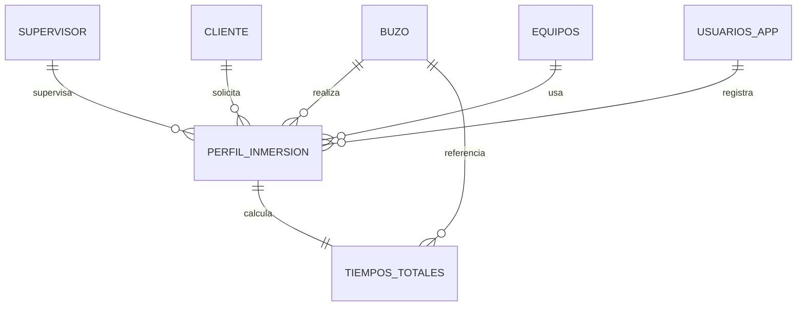

# MDIBUCEO — Documentación del proyecto

Bitácora de inmersiones para MDI Buceo (Puerto Varas, Chile). App web responsive para registrar inmersiones y mantener los catálogos de buzos, equipos, supervisores y clientes, con control de acceso por roles.

## 1. Resumen ejecutivo

| | |
|---|---|
| **Nombre app** | MDIBUCEO |
| **Repositorio** | github.com/micartesr/inmersion |
| **Carpeta local** | `~/Downloads/Claude_2026/inmersion` |
| **Base de datos** | Supabase (Postgres) — proyecto `mdibuceo`, región `sa-east-1` |
| **Hosting** | Vercel — proyecto `mdibuceo`, team `micartesr-3914s-projects` |
| **Stack** | Vite + React 18 + TypeScript + Tailwind CSS + Supabase JS |
| **Auth** | Supabase Auth (email/password) con roles: `admin`, `supervisor`, `lectura` |

## 2. Stack tecnológico

- **Frontend:** Vite, React 18, TypeScript, React Router 6, Tailwind CSS.
- **Backend:** Supabase (Postgres 17, Auth, RLS, PostgREST autogenerado). Sin backend propio — el cliente habla directo con Supabase, protegido por Row Level Security.
- **Validación:** Zod en el cliente + `CHECK` constraints en la base de datos como segunda barrera.
- **Hosting:** Vercel, SPA estática con rewrite a `index.html` (`vercel.json`) para que funcione el ruteo de React Router.

## 3. Estructura de carpetas

```
inmersion/
├── index.html
├── package.json
├── vite.config.ts
├── tailwind.config.js
├── postcss.config.js
├── tsconfig.json
├── vercel.json
├── .env.example
└── src/
    ├── main.tsx              # entry point, providers (Router, AuthProvider)
    ├── App.tsx                # definición de rutas
    ├── index.css              # tema Tailwind + clases utilitarias (.card, .btn-primary, etc.)
    ├── lib/
    │   ├── supabaseClient.ts  # cliente Supabase (URL + anon key)
    │   ├── types.ts           # tipos TS generados/alineados al esquema
    │   ├── auth.tsx           # AuthProvider + hook useAuth (sesión, rol, esAdmin, esEditor)
    │   ├── useCrud.ts         # hook genérico para list/insert/update/delete por tabla
    │   ├── validators.ts      # esquemas Zod por formulario
    │   └── format.ts          # helpers (RUT, fechas, cálculo de minutos entre horas)
    ├── components/
    │   ├── Layout.tsx         # sidebar desktop / tab bar mobile + navegación pill
    │   ├── Logo.tsx           # ícono original inspirado en máscara de buceo
    │   ├── ProtectedRoute.tsx # exige sesión activa; RoleGate exige rol
    │   ├── DataTable.tsx      # tabla responsive reutilizable
    │   ├── FormField.tsx      # input/select/textarea con label + error
    │   ├── Badge.tsx          # estados (activo/inactivo, vencimientos)
    │   ├── StatTile.tsx       # tarjetas KPI del dashboard
    │   ├── EmptyState.tsx     # estado vacío (ilustración + CTA)
    │   └── Modal.tsx          # confirmaciones (ej. eliminar registro)
    └── pages/
        ├── Login.tsx
        ├── Dashboard.tsx           # "Resumen"
        ├── Inmersiones.tsx         # listado + filtros
        ├── NuevaInmersion.tsx      # alta/edición de inmersión + tiempos totales
        ├── DetalleInmersion.tsx    # ficha de una inmersión
        ├── Usuarios.tsx            # panel admin: asignar roles
        └── mantenedores/
            ├── Buzos.tsx
            ├── Equipos.tsx
            ├── Supervisores.tsx
            └── Clientes.tsx
```

## 4. Modelo de datos

Base `mdibuceo` en Supabase, esquema `public`, con Row Level Security activada en **todas** las tablas.

### 4.1 Catálogos (maestros)

**`buzo`**
| columna | tipo | notas |
|---|---|---|
| id_buzo | uuid PK | `gen_random_uuid()` |
| rut_buzo | text | `UNIQUE`, `NOT NULL` |
| nombre_buzo | text | `NOT NULL` |
| clase_matricula | text | |
| vencimiento_hipervarico | date | |
| estado | text | `CHECK IN ('activo','inactivo','suspendido')`, default `'activo'` |
| created_at / updated_at | timestamptz | trigger automático |

**`equipos`**
| columna | tipo | notas |
|---|---|---|
| numero_serie_ordenador | text PK | |
| tipo_equipo_buceo | text | `NOT NULL` |
| matricula_equipo | text | |
| vencimiento_equipo | date | |

**`supervisor`**
| columna | tipo | notas |
|---|---|---|
| id_supervisor | uuid PK | |
| rut_super | text | `UNIQUE`, `NOT NULL` |
| nombre_super | text | `NOT NULL` |

**`cliente`**
| columna | tipo | notas |
|---|---|---|
| id_cliente | uuid PK | |
| nombre_cliente | text | `NOT NULL` |
| observacion | text | |

### 4.2 Transaccionales

**`perfil_inmersion`** — evento de inmersión. El pedido original no traía llaves foráneas explícitas; se agregaron para integridad referencial real:
| columna | tipo | notas |
|---|---|---|
| id_inmersion | uuid PK | |
| fecha_inmersion | date | `NOT NULL` |
| hora_dejo_superficie / hora_llego_fondo / hora_dejo_fondo / hora_llego_superficie | time | `CHECK` de orden cronológico entre sí |
| id_buzo | uuid | FK → `buzo`, `NOT NULL`, `ON DELETE RESTRICT` |
| id_supervisor | uuid | FK → `supervisor`, `ON DELETE RESTRICT` |
| id_cliente | uuid | FK → `cliente`, `ON DELETE RESTRICT` |
| numero_serie_ordenador | text | FK → `equipos`, `ON DELETE RESTRICT` |
| ubicacion, temperatura_agua, estado_mar, faena_realizada | — | campos adicionales tomados del diseño de referencia |
| created_by | uuid | FK → `usuarios_app` |

**`tiempos_totales`** — 1:1 con `perfil_inmersion`:
| columna | tipo | notas |
|---|---|---|
| id_inmersion | uuid PK/FK | → `perfil_inmersion`, `ON DELETE CASCADE` |
| id_buzo | uuid | FK → `buzo`; un trigger (`check_tiempos_totales_buzo`) obliga a que coincida con el buzo de la inmersión asociada |
| tiempo_total_fondo, tiempo_total_descompresion, tiempo_total_buceo | integer (minutos) | `CHECK >= 0` |
| profundidad_maxima | numeric | `CHECK >= 0` |
| tabulacion | text | |

### 4.3 Seguridad de acceso

**`usuarios_app`** — perfil de aplicación 1:1 con `auth.users` de Supabase:
| columna | tipo | notas |
|---|---|---|
| id | uuid PK/FK | → `auth.users`, `ON DELETE CASCADE` |
| nombre | text | |
| rol | enum `user_role` | `admin` \| `supervisor` \| `lectura`, default `lectura` |
| activo | boolean | default `true` |

Un trigger (`handle_new_user`) crea automáticamente la fila en `usuarios_app` con rol `lectura` apenas alguien se registra — nadie puede auto-asignarse un rol mayor.

### 4.4 Diagrama de relaciones


```mermaid
erDiagram
    BUZO ||--o{ PERFIL_INMERSION : realiza
    SUPERVISOR ||--o{ PERFIL_INMERSION : supervisa
    CLIENTE ||--o{ PERFIL_INMERSION : solicita
    EQUIPOS ||--o{ PERFIL_INMERSION : usa
    USUARIOS_APP ||--o{ PERFIL_INMERSION : registra
    PERFIL_INMERSION ||--|| TIEMPOS_TOTALES : calcula
    BUZO ||--o{ TIEMPOS_TOTALES : referencia
```

## 5. Seguridad (Row Level Security)

Ninguna tabla es accesible sin sesión válida — no hay acceso anónimo a datos.

| Tabla | SELECT | INSERT / UPDATE | DELETE |
|---|---|---|---|
| `buzo`, `equipos`, `supervisor`, `cliente` | usuario activo | `admin` o `supervisor` | solo `admin` |
| `perfil_inmersion`, `tiempos_totales` | `admin` y `supervisor` ven todo; un `buzo` ve **solo sus propias inmersiones** (`is_editor() OR id_buzo = mi_id_buzo()`) | `admin`, `supervisor`, o el propio buzo mientras esté pendiente | solo `admin` |
| `usuarios_app` | propia fila, o todas si `admin` | `admin` únicamente | solo `admin` |

Implementado con funciones `SECURITY DEFINER` (`is_active_user()`, `is_editor()`, `is_admin()`) para evitar recursión de RLS. Se corrigieron los warnings del linter de seguridad de Supabase (`search_path` fijo en funciones trigger, `handle_new_user` sin acceso público por RPC). Los únicos warnings restantes son intencionales: las funciones helper de rol deben ser ejecutables por `authenticated`/`anon` para que las políticas RLS funcionen; solo devuelven un booleano sobre la sesión propia, no exponen datos.

La **anon/publishable key** de Supabase está pensada para ser pública — la protección real vive en RLS, no en ocultar esa key. La `service_role key` nunca se usa en el cliente.

## 6. Variables de entorno

```
VITE_SUPABASE_URL=https://ozwbhpdulgibbvtzzydl.supabase.co
VITE_SUPABASE_ANON_KEY=sb_publishable_7pRmUcsISDqelf4Bow96rw_GM5d0jtw
```

Ya están como valores por defecto en `src/lib/supabaseClient.ts`, así que el build funciona igual sin configurarlas en Vercel. `.env.example` documenta el formato por si se prefiere sobreescribirlas.

## 7. Mapa de pantallas

| Ruta | Pantalla | Acceso |
|---|---|---|
| `/login` | Inicio de sesión / registro | público |
| `/` | Resumen (KPIs: inmersiones del mes, total histórico, buzos activos, minutos de buceo del mes) | usuario activo |
| `/inmersiones` | Listado y filtros | usuario activo |
| `/inmersiones/nueva` | Registrar inmersión | `admin` / `supervisor` |
| `/inmersiones/:id` | Detalle de inmersión | usuario activo |
| `/inmersiones/:id/editar` | Editar inmersión | `admin` / `supervisor` |
| `/mantenedores/buzos` | CRUD de buzos | lectura para todos, escritura `admin`/`supervisor` |
| `/mantenedores/equipos` | CRUD de equipos | ídem |
| `/mantenedores/supervisores` | CRUD de supervisores | ídem |
| `/mantenedores/clientes` | CRUD de clientes | ídem |
| `/usuarios` | Asignar roles a usuarios | solo `admin` |

## 8. Sistema de diseño

Réplica del artefacto de referencia: tema oscuro náutico.

| Token | Valor | Uso |
|---|---|---|
| `navy-950` | `#0a141c` | fondo general |
| `navy-900` | `#0f1b24` | fondo de tarjetas |
| `navy-700` | `#1c2f3a` | bordes |
| `coral-500` | `#e8794f` | acciones primarias, tab activo |
| `amber-400` | `#d9a84e` | labels tipo "eyebrow" (mayúsculas, monoespaciado) |

Tipografía: system-ui sans para texto general, monoespaciada para etiquetas de sección. Radios grandes (tarjetas `1.25rem`, botones tipo pill totalmente redondeados). El logo es un ícono original inspirado en máscara de buceo (no una copia del artwork del artefacto, por política de derechos de autor).

## 9. Despliegue

### 9.1 Supabase — ✅ hecho
- Proyecto `mdibuceo` (`ozwbhpdulgibbvtzzydl`) activo en `sa-east-1`, plan free.
- Migraciones aplicadas: extensiones/roles, catálogos, tablas transaccionales, políticas RLS, fix de advisors.

### 9.2 GitHub — ⏳ pendiente de tu lado
Repo `github.com/micartesr/inmersion` ya existe. El código está commiteado localmente con el remote configurado. Este entorno no tiene credenciales de GitHub, así que falta correr desde tu Terminal:
```bash
cd ~/Downloads/Claude_2026/inmersion
git push -u origin main
```

### 9.3 Vercel — ⏳ pendiente de tu lado
El deploy vía API quedó publicado pero detrás del muro **"Vercel Authentication"** (SSO), y las herramientas de gestión de este entorno no logran leer/modificar el proyecto en tu cuenta (bug de permisos entre el token de deploy y el de administración de esta integración). Camino recomendado — Vercel CLI desde tu Terminal:
```bash
cd ~/Downloads/Claude_2026/inmersion
npm install
npx vercel login
npx vercel --prod
```
Alternativa: entrar a vercel.com → proyecto `mdibuceo` → Settings → Deployment Protection → desactivar "Vercel Authentication".

## 10. Puesta en marcha — primer administrador

1. Alguien entra a la app y se registra (crea cuenta con email/password). Automáticamente queda con rol `lectura`.
2. Se me indica el email usado.
3. Se ejecuta una sola vez en Supabase:
   ```sql
   update public.usuarios_app set rol = 'admin' where id = (
     select id from auth.users where email = 'correo@ejemplo.com'
   );
   ```
4. Desde ahí, ese usuario admin puede promover a otros desde `/usuarios`.

## 11. Pendientes

- [ ] `git push` a GitHub (paso 9.2).
- [ ] Desbloquear acceso público en Vercel (paso 9.3).
- [ ] Registrar el primer usuario y promoverlo a `admin` (paso 10).
- [ ] Prueba end-to-end: login, CRUD de cada mantenedor, registro de inmersión completo, verificar que un usuario `lectura` no pueda escribir.

## 12. Diccionario de datos

Detalle columna por columna de las 7 tablas de `mdibuceo` (esquema `public`). PK = llave primaria, FK = llave foránea.

### usuarios_app
| Columna | Tipo | Nulo | Clave | Descripción |
|---|---|---|---|---|
| id | uuid | No | PK / FK → auth.users | Identificador del usuario, igual al de Supabase Auth |
| nombre | text | No | | Nombre visible del usuario (se autocompleta desde el email al registrarse) |
| rol | user_role (enum) | No | | `admin` \| `supervisor` \| `lectura`. Default `lectura`; solo un admin puede subirlo |
| activo | boolean | No | | Si es `false`, el usuario pierde todo acceso a los datos (RLS lo bloquea) sin borrar su cuenta |
| created_at | timestamptz | No | | Fecha de creación del perfil |
| updated_at | timestamptz | No | | Se actualiza automáticamente en cada cambio |

### buzo
| Columna | Tipo | Nulo | Clave | Descripción |
|---|---|---|---|---|
| id_buzo | uuid | No | PK | Identificador interno del buzo |
| rut_buzo | text | No | UNIQUE | RUT chileno del buzo, único en el sistema |
| nombre_buzo | text | No | | Nombre completo |
| clase_matricula | text | Sí | | Clase de matrícula de buceo (ej. "Primera", "Segunda") |
| vencimiento_hipervarico | date | Sí | | Fecha de vencimiento del examen/certificado hiperbárico |
| estado | text | No | CHECK | `activo` \| `inactivo` \| `suspendido`. Default `activo` |
| created_at / updated_at | timestamptz | No | | Trazabilidad automática |

### equipos
| Columna | Tipo | Nulo | Clave | Descripción |
|---|---|---|---|---|
| numero_serie_ordenador | text | No | PK | N° de serie del computador de buceo; identificador natural del equipo |
| tipo_equipo_buceo | text | No | | Tipo de equipo (ej. "Semi-autónomo", "Autónomo", "Superficie") |
| matricula_equipo | text | Sí | | Matrícula/registro oficial del equipo |
| vencimiento_equipo | date | Sí | | Fecha de vencimiento de certificación/mantención |
| created_at / updated_at | timestamptz | No | | Trazabilidad automática |

### supervisor
| Columna | Tipo | Nulo | Clave | Descripción |
|---|---|---|---|---|
| id_supervisor | uuid | No | PK | Identificador interno del supervisor |
| rut_super | text | No | UNIQUE | RUT del supervisor |
| nombre_super | text | No | | Nombre completo |
| created_at / updated_at | timestamptz | No | | Trazabilidad automática |

### cliente
| Columna | Tipo | Nulo | Clave | Descripción |
|---|---|---|---|---|
| id_cliente | uuid | No | PK | Identificador interno del cliente/mandante |
| nombre_cliente | text | No | | Razón social o nombre del cliente |
| observacion | text | Sí | | Notas libres sobre el cliente |
| created_at / updated_at | timestamptz | No | | Trazabilidad automática |

### perfil_inmersion
| Columna | Tipo | Nulo | Clave | Descripción |
|---|---|---|---|---|
| id_inmersion | uuid | No | PK | Identificador de la inmersión |
| fecha_inmersion | date | No | | Fecha en que se realizó la inmersión |
| hora_dejo_superficie | time | Sí | | Hora en que el buzo deja la superficie |
| hora_llego_fondo | time | Sí | | Hora en que el buzo llega al fondo |
| hora_dejo_fondo | time | Sí | | Hora en que el buzo deja el fondo |
| hora_llego_superficie | time | Sí | | Hora en que el buzo llega de vuelta a superficie |
| id_buzo | uuid | No | FK → buzo | Buzo que realizó la inmersión |
| id_supervisor | uuid | Sí | FK → supervisor | Supervisor a cargo |
| id_cliente | uuid | Sí | FK → cliente | Cliente/mandante de la faena |
| numero_serie_ordenador | text | Sí | FK → equipos | Equipo/computador de buceo usado |
| ubicacion | text | Sí | | Lugar geográfico de la inmersión |
| temperatura_agua | numeric(4,1) | Sí | | Temperatura del agua en °C |
| estado_mar | text | Sí | | Condición del mar al momento de la inmersión |
| faena_realizada | text | Sí | | Descripción libre del trabajo realizado |
| created_by | uuid | Sí | FK → usuarios_app | Usuario de la app que registró la inmersión |
| created_at / updated_at | timestamptz | No | | Trazabilidad automática |

Regla adicional: `CHECK` de orden cronológico — dejó superficie ≤ llegó fondo ≤ dejó fondo ≤ llegó superficie (cuando esos valores existen).

### tiempos_totales
| Columna | Tipo | Nulo | Clave | Descripción |
|---|---|---|---|---|
| id_inmersion | uuid | No | PK / FK → perfil_inmersion | Relación 1:1 con la inmersión; se borra en cascada si se borra la inmersión |
| id_buzo | uuid | No | FK → buzo | Debe coincidir con el buzo de `perfil_inmersion` (validado por trigger) |
| tiempo_total_fondo | integer | Sí | CHECK ≥ 0 | Minutos desde que deja la superficie hasta que deja el fondo (descenso + permanencia en fondo) |
| tiempo_total_descompresion | integer | Sí | CHECK ≥ 0 | Minutos totales de descompresión |
| tiempo_total_buceo | integer | Sí | CHECK ≥ 0 | Minutos totales de buceo (superficie a superficie) |
| profundidad_maxima | numeric(5,1) | Sí | CHECK ≥ 0 | Profundidad máxima alcanzada, en metros |
| tabulacion | text | Sí | | Tabla de descompresión usada (ej. "US Navy") |
| created_at / updated_at | timestamptz | No | | Trazabilidad automática |

## 13. Manual de usuario

### 13.1 Roles y qué puede hacer cada uno
| Rol | Puede |
|---|---|
| lectura | Ver el resumen, el listado de inmersiones y todos los mantenedores. No puede crear ni editar nada |
| supervisor | Todo lo de lectura, más: crear/editar inmersiones y crear/editar registros en los mantenedores |
| admin | Todo lo de supervisor, más: eliminar registros y asignar roles en "Usuarios" |

Todo usuario nuevo entra como `lectura` por defecto; un administrador debe subirle el rol manualmente desde `/usuarios`.

### 13.2 Iniciar sesión / registrarse
1. Entra a la URL de la app.
2. Si es tu primera vez, usa la opción de registro con tu correo y una contraseña.
3. Si ya tienes cuenta, inicia sesión normalmente.
4. Si acabas de registrarte, avisa a un administrador para que te asigne el rol correspondiente (por defecto quedas en solo lectura).

### 13.3 Resumen (pantalla principal)
Muestra los indicadores clave: inmersiones del mes, total histórico, buzos activos y minutos de buceo del mes en curso (suma de `tiempo_total_buceo` de todos los buzos).

### 13.4 Registrar una inmersión
1. Ve a **Inmersiones → Nueva inmersión** (requiere rol `supervisor` o `admin`).
2. Completa **Identificación**: fecha, buzo, ubicación.
3. Completa **Perfil de la inmersión**: profundidad máxima y las 4 horas (dejó superficie, llegó fondo, dejó fondo, llegó superficie). El sistema valida que estén en orden cronológico.
4. Completa **Tiempos totales**: solo la descompresión se escribe a mano; el tiempo de fondo y el buceo total se calculan solos desde las horas del punto 3.
5. Completa **Condiciones**: temperatura del agua y estado del mar.
6. Completa **Equipo**: número de serie del ordenador y tipo de equipo utilizado.
7. Completa **Tabulación y faena realizada**: tabla de descompresión usada y descripción del trabajo.
8. Presiona **Registrar inmersión**.

### 13.5 Consultar y editar inmersiones
- **Inmersiones** muestra el listado completo con filtros (por fecha, buzo, cliente).
- Haz clic en una fila para ver el detalle completo.
- Con rol `supervisor` o `admin` aparece el botón **Editar**; con rol `admin` también aparece **Eliminar**.

### 13.6 Mantenedores (Buzos, Equipos, Supervisores, Clientes)
Cada mantenedor sigue el mismo patrón:
- **Listar:** todos los usuarios activos pueden ver la tabla completa.
- **Crear:** botón "+ Nuevo" (solo `supervisor`/`admin`), completa el formulario y guarda.
- **Editar:** clic en el lápiz de la fila (solo `supervisor`/`admin`).
- **Eliminar:** clic en el ícono de basurero (solo `admin`). Si el registro está en uso por alguna inmersión, el sistema **impide el borrado** para no perder integridad histórica — en ese caso, cambia su `estado` a inactivo en vez de eliminarlo (aplica sobre todo a Buzos).

### 13.7 Gestión de usuarios (solo admin)
En `/usuarios`, un administrador ve todos los usuarios registrados y puede:
- Cambiar el rol de cualquier usuario (`lectura` ↔ `supervisor` ↔ `admin`).
- Desactivar un usuario (`activo = false`) para revocarle el acceso sin borrar su cuenta.

### 13.8 Uso en celular y tablet
La app es responsive: en pantallas angostas la navegación pasa de barra lateral a barra inferior de pestañas, y las tablas se adaptan a formato de tarjetas apilables para no requerir scroll horizontal.

### 13.9 Preguntas frecuentes
| Problema | Causa / solución |
|---|---|
| "No tienes permiso para acceder a esta sección" | Tu rol es `lectura`. Pide a un admin que te suba a `supervisor` en /usuarios |
| No puedo borrar un buzo/equipo | Tiene inmersiones asociadas; la base de datos protege ese historial. Marca el registro como inactivo en vez de borrarlo |
| Recién me registré y no veo nada editable | Es esperado: todo usuario nuevo parte en `lectura`. Pide que te asignen rol |
| Error de horas en el formulario de inmersión | Las 4 horas deben ir en orden: dejó superficie ≤ llegó fondo ≤ dejó fondo ≤ llegó superficie |

## 14. Manual de configuración

### 14.1 Requisitos previos
- Node.js 18+ y npm (para correr o compilar el proyecto localmente).
- Cuenta de GitHub con acceso al repo `micartesr/inmersion`.
- Cuenta de Vercel (team `micartesr-3914s-projects`).
- Cuenta de Supabase (organización `Home`, proyecto `mdibuceo`).

### 14.2 Correr el proyecto en local
```bash
cd ~/Downloads/Claude_2026/inmersion
npm install
npm run dev
```
Abre la URL que imprime Vite (por defecto `http://localhost:5173`). No necesitas configurar variables de entorno: la URL y la anon key de Supabase ya vienen por defecto en `src/lib/supabaseClient.ts`.

### 14.3 Variables de entorno (opcional)
Si prefieres no depender de los valores por defecto, crea un archivo `.env.local` (nunca se sube a git) a partir de `.env.example`:
```
VITE_SUPABASE_URL=https://ozwbhpdulgibbvtzzydl.supabase.co
VITE_SUPABASE_ANON_KEY=sb_publishable_7pRmUcsISDqelf4Bow96rw_GM5d0jtw
```

### 14.4 Publicar en GitHub
```bash
cd ~/Downloads/Claude_2026/inmersion
git push -u origin main
```
El remote `origin` ya apunta a `https://github.com/micartesr/inmersion.git`. Requiere que tu Terminal tenga sesión de GitHub (Personal Access Token o `gh auth login`).

### 14.5 Publicar en Vercel
```bash
cd ~/Downloads/Claude_2026/inmersion
npx vercel login
npx vercel --prod
```
Si el proyecto queda detrás de un muro de acceso, entra a **vercel.com → proyecto mdibuceo → Settings → Deployment Protection** y desactiva "Vercel Authentication" para que sea público.

### 14.6 Administrar la base de datos (Supabase)
- **Dashboard:** app.supabase.com → proyecto `mdibuceo` (ref `ozwbhpdulgibbvtzzydl`).
- **SQL Editor:** para correr consultas puntuales o nuevas migraciones.
- **Table Editor:** para revisar/editar datos manualmente.
- **Authentication → Users:** para ver o eliminar cuentas de acceso.

### 14.7 Crear el primer administrador
1. Que alguien se registre en la app (queda con rol `lectura`).
2. En el SQL Editor de Supabase, ejecutar una sola vez:
```sql
update public.usuarios_app set rol = 'admin' where id = (
  select id from auth.users where email = 'correo@ejemplo.com'
);
```
3. Desde ese momento, esa persona administra roles desde `/usuarios` sin volver a tocar SQL.

### 14.8 Agregar nuevas columnas o tablas (migraciones)
1. Escribir el SQL de la migración (DDL) con nombre descriptivo en snake_case.
2. Aplicarla contra el proyecto `mdibuceo`.
3. Revisar advisors de seguridad y performance; corregir cualquier warning nuevo.
4. Si agrega una tabla nueva: `alter table ... enable row level security;` y sus policies correspondientes — sin RLS, PostgREST la deja inaccesible por defecto (fail-safe), pero hay que agregarla explícitamente a las policies para que sea usable.

### 14.9 Seguridad y rotación de claves
- La **anon/publishable key** es segura de exponer en el frontend; si se filtra la **service_role key** (nunca debería usarse en el cliente), rotarla de inmediato desde Supabase → Settings → API.
- Revisar periódicamente los advisors de seguridad tras cualquier cambio de esquema.
- Los roles de acceso (`admin`/`supervisor`/`lectura`) son la única forma de otorgar permisos de escritura; nunca dar la service_role key a usuarios finales.

### 14.10 Respaldo de datos
Supabase mantiene backups automáticos diarios en el plan free (retención limitada). Para un respaldo manual on-demand: Supabase Dashboard → Database → Backups, o `pg_dump` contra la connection string del proyecto.

### 14.11 Checklist de troubleshooting
| Síntoma | Revisar |
|---|---|
| La app no carga datos / pantalla en blanco | Consola del navegador; confirmar que `VITE_SUPABASE_URL`/`ANON_KEY` sean correctas |
| "row-level security policy" al guardar | El usuario no tiene el rol necesario (`supervisor`/`admin`) o su fila en `usuarios_app` tiene `activo = false` |
| No puedo desplegar a Vercel | Confirmar sesión con `npx vercel login`; revisar Deployment Protection si la URL pide autenticación |
| `git push` pide usuario/clave | Configurar un Personal Access Token de GitHub o `gh auth login` |

---

## 15. Cambios versión 1.2.0 (Fase 3)

Donde esta sección contradiga a las anteriores, manda esta.

### 15.1 Tabla US Navy: ahora es un mantenedor
Se recreó **vacía** con solo `id_navy`, `composicion` y `observacion`, administrable desde `/mantenedores/tabla-us-navy`. Lo que se cargue ahí es exactamente lo que aparece en el desplegable "Tabulación Tabla US Navy" al registrar una inmersión; si está vacío, el formulario lo advierte. Al vaciar el catálogo se perdió la tabulación asociada a una de las 3 inmersiones históricas (consecuencia esperada).

### 15.2 La tabulación se guarda en la inmersión
El campo pasó de `tiempos_totales.id_navy` a **`perfil_inmersion.id_navy`** (FK → `tabla_us_navy`, `ON DELETE RESTRICT`), que es donde se selecciona en la interfaz. La composición no se duplica como texto: se lee por la relación.

### 15.3 Mantenedor de buzos: correo y habilitación
| Columna nueva | Tipo | Descripción |
|---|---|---|
| email | text (único, case-insensitive) | Correo con el que el buzo creará su cuenta |
| habilitado | boolean NOT NULL default false | Todo buzo nuevo nace deshabilitado |

Flujo: admin/supervisor carga al buzo con su correo → queda deshabilitado → lo habilita desde el botón de la tabla → recién ahí el buzo puede crear cuenta. No se puede habilitar un buzo sin correo registrado.

### 15.4 Registro de cuentas controlado
| Situación | Resultado |
|---|---|
| Correo de buzo habilitado | Crea la cuenta ligada a su ficha, rol buzo, activa |
| Correo de buzo NO habilitado | "Tu ficha de buzo existe pero aún no está habilitada..." |
| Correo no registrado como buzo | "Este correo no está registrado como buzo en el sistema..." |

El trigger `handle_new_user` aplica la misma regla en la base de datos, así que no se puede saltar desde el cliente. Las cuentas que no correspondan a un buzo quedan inactivas hasta que un admin les asigne rol.

### 15.5 Recuperación de contraseña (solo admin y supervisor)
Enlace en la pantalla de ingreso. `puede_recuperar_password(email)` valida en el servidor que el correo sea de un admin/supervisor activo antes de enviar el correo; la UI responde siempre lo mismo para no revelar qué correos existen. El enlace lleva a `/nueva-password`. Los buzos no tienen recuperación por correo.

### 15.6 Mensajes de error explicativos
Nuevo módulo `src/lib/errores.ts`: traduce errores de Postgres/RLS a la causa concreta (horas fuera de orden, buzo de emergencia repetido, falta de permisos por rol, cliente sin centros de cultivo, buzo sin ficha ligada, inmersión ya validada, sin conexión).

### 15.7 Usuario en sesión visible
Nombre y rol del usuario conectado en la barra lateral (escritorio) y en la cabecera superior (móvil).

### 15.8 Acceso de los buzos
Un usuario con rol buzo no ve Mantenedores ni Administración (ocultos en la navegación), con las rutas protegidas en el enrutador además de por RLS.

### 15.9 Correcciones técnicas
- Reparadas cuentas sin perfil en `usuarios_app`; el ingreso sin perfil queda bloqueado con mensaje explicativo.
- Corregidos todos los errores de tipos del proyecto: `tsc --noEmit` pasa limpio.

### 15.10 Rutas nuevas
| Ruta | Pantalla | Acceso |
|---|---|---|
| /nueva-password | Definir nueva contraseña desde el enlace del correo | público (con enlace válido) |
| /mantenedores/tabla-us-navy | Mantenedor Tabla US Navy | admin / supervisor |

---

## 16. Cambios versión 1.7.1

Donde esta sección contradiga a las anteriores, manda esta.

### 16.1 Nuevo cálculo del Tiempo de Fondo
En **Nueva inmersión → Tiempos totales**, el campo **Tiempo de Fondo (mins)** ahora suma el descenso más la permanencia en el fondo, es decir el tramo completo **desde que el buzo deja la superficie hasta que deja el fondo**. Antes contaba solo desde que llegaba al fondo.

| Ejemplo | Antes | Ahora |
|---|---|---|
| dejó superficie 11:02 · llegó fondo 11:03 · dejó fondo 11:50 | 47 min | **48 min** |

Es el *bottom time* de las tablas US Navy. El campo **Tiempo total buceo** no cambió: sigue midiendo de superficie a superficie (`hora_dejo_superficie` → `hora_llego_superficie`).

Las inmersiones registradas **antes** de este cambio conservan en `tiempos_totales.tiempo_total_fondo` el valor calculado con la regla anterior; solo se recalculan si se reabren y se vuelven a guardar.

---

## 17. Cambios versión 1.7.2

Donde esta sección contradiga a las anteriores, manda esta.

### 17.1 Los supervisores validan inmersiones
El bloque **Validación** de la ficha de una inmersión (observación y botón *Validar*) ahora es visible para `admin` **y** `supervisor`. El permiso real vive en el trigger `protect_validacion_fields`, cuya condición pasó de `is_admin()` a `is_editor()`: quien no sea editor sigue sin poder tocar `estado_validacion`, `observacion_admin`, `validado_por` ni `validado_at` — la base revierte esos campos en silencio.

**Una inmersión ya validada la sigue cerrando solo el admin.** La segunda regla del trigger no cambió: si `old.estado_validacion = 'validada'` y quien edita no es admin, la operación falla con "La inmersión ya fue validada y no puede modificarse.". Un supervisor no puede corregir ni su propia validación.

### 17.2 Sello de auditoría de la validación
Hasta ahora `validado_por` y `validado_at` nunca se llenaban: el cliente solo escribía el estado y la observación, y el texto "Validada el …" de la ficha salía siempre vacío. Con más de un rol validando, el trigger ahora estampa ambos campos en el momento en que la inmersión pasa a `validada`:

```sql
if new.estado_validacion = 'validada' and old.estado_validacion <> 'validada' then
  new.validado_por := (select auth.uid());
  new.validado_at := now();
end if;
```

Lo escribe la base, no el cliente, así que no se puede falsear desde el frontend.

### 17.3 Nueva tarjeta "Minutos de Buceo Mensual"
En el Resumen, la tarjeta **Vencimientos próx.** fue reemplazada por **Minutos de Buceo Mensual**: la suma de `tiempos_totales.tiempo_total_buceo` de todas las inmersiones del mes en curso, de todos los buzos. Se eliminaron las dos consultas de vencimientos, así que la pantalla hace 5 consultas en vez de 6.

**Consecuencia a tener presente:** desapareció el único aviso proactivo de vencimientos. Los equipos conservan su insignia de estado en el mantenedor de Equipos, pero el mantenedor de Buzos muestra la fecha del hipervárico como texto plano, sin destacar los próximos a vencer. Queda pendiente agregarle esa insignia.

---

## 18. Cambios versión 1.7.3

Donde esta sección contradiga a las anteriores, manda esta.

### 18.1 Selector de columnas en el mantenedor de Buzos
El mantenedor de Buzos incorpora el mismo botón **Columnas (N)** que ya tenía el de Equipos: un panel con una casilla por columna, y la selección guardada por navegador en `localStorage` (clave `mdibuceo_buzos_columnas`). Se reutilizó el marcado y las clases del selector de Equipos para que ambos se vean y se comporten igual.

**Nombre** queda fija como columna identificadora —el equivalente a Matrícula en Equipos— junto con la columna de acciones (Editar / Eliminar). El resto es parametrizable:

| Columna | Id | Visible por defecto |
|---|---|---|
| RUT | `rut` | sí |
| Correo | `correo` | sí |
| Clase / matrícula | `clase_matricula` | sí |
| Venc. matrícula | `venc_matricula` | no |
| Venc. hiperbárico | `venc_hipervarico` | sí |
| Ordenador asignado | `ordenador` | sí |
| Acceso al sistema | `habilitado` | no |
| Estado | `estado` | sí |

Las visibles por defecto son las mismas que la tabla mostraba antes del cambio, así que nadie ve su pantalla alterada sin haberlo pedido.

### 18.2 Dos columnas nuevas, apagadas por defecto
`fecha_vencimiento_matricula` y `habilitado` existían en la ficha del buzo pero nunca se habían mostrado en la tabla. Ahora están disponibles como columnas opcionales: **Venc. matrícula** y **Acceso al sistema** (esta última con insignia verde/gris), para no tener que abrir cada ficha.

---

## 19. Cambios versión 1.7.4 — Integridad de los tiempos de la inmersión

Donde esta sección contradiga a las anteriores, manda esta.

### 19.1 El problema
Una inmersión del 9 de septiembre quedó guardada con `profundidad_maxima` en null. La causa no fue la base: el formulario solo verificaba que el campo no estuviera vacío, y después `parseDecimal()` convertía en **null silencioso** cualquier texto no numérico (`24,4 mts`, `24 metros`). La aplicación mostraba "guardado" y el dato se perdía. El mismo patrón afectaba a `temperatura_agua` y, vía `Number()` → `NaN` → null, a `tiempo_total_descompresion`.

Además esa inmersión **se validó igual**, sin que nada advirtiera que estaba incompleta.

### 19.2 Validación numérica real en el formulario
`src/pages/NuevaInmersion.tsx` ahora convierte primero y rechaza si el resultado no es un número, en vez de mirar solo que el campo tenga algo escrito:

| Campo | Regla |
|---|---|
| Profundidad máxima | Obligatorio, número > 0 y ≤ 60 |
| Temperatura del agua | Obligatorio, número válido |
| Tiempo de descompresión | Obligatorio, número ≥ 0 |

El techo de 60 m es el límite operacional definido por MDI Buceo y vive en la constante `PROFUNDIDAD_MAXIMA_M`. La máxima registrada en la bitácora es 32,9 m; el tope existe para atrapar errores de tipeo como 244 en vez de 24,4.

**Descompresión pasó a ser obligatoria con el 0 explícito.** Antes, dejarla vacía confundía "no requirió descompresión" con "no se registró el dato", y no había forma de separarlos: de 73 registros, 10 estaban en null y **ninguno en cero**.

### 19.3 Restricciones en la base (`0003_datos_obligatorios.sql`)
La validación del navegador es experiencia de usuario, no seguridad: se puede saltar llamando la API directamente. El control real quedó en la base.

```sql
check (profundidad_maxima is not null and profundidad_maxima > 0 and profundidad_maxima <= 60)  -- NOT VALID
check (tiempo_total_descompresion is not null and tiempo_total_descompresion >= 0)              -- NOT VALID
check (tiempo_total_fondo is not null and tiempo_total_buceo is not null)                       -- validada
```

Las dos primeras son `NOT VALID` a propósito: rigen para toda inserción y modificación desde ahora, pero no revisan las 11 filas históricas que las violarían, porque la instrucción fue no tocar los registros cargados. Además es instantánea — no recorre ni bloquea la tabla. Fondo y buceo no tienen ningún null, así que esa sí se agregó validada.

Cuando esas 11 filas se corrijan (con cuenta de administrador), confirmar con `validate constraint`.

### 19.4 No se puede validar una inmersión incompleta (`0004_validar_solo_completas.sql`)
El trigger `protect_validacion_fields` ahora rechaza el paso a `validada` si la inmersión no tiene profundidad máxima y tiempo de descompresión. Va en el trigger y no en el botón, así que aplica aunque se llame la API directamente. Se mantiene `SECURITY INVOKER` y el `search_path` fijo: RLS no cambia para ningún rol.

Dos correcciones respecto de la versión anterior del trigger:

- **El rol se lee una sola vez** en el bloque `declare`, en vez de consultar `usuarios_app` hasta cuatro veces por fila actualizada.
- **La verificación pregunta en positivo** (`not exists` de una fila *completa*) en lugar de buscar una fila incompleta. La forma negada dejaba pasar el caso de que no existiera fila de `tiempos_totales`, que es el más incompleto de todos.

### 19.5 Mensajes de error
`src/lib/errores.ts` traduce las tres restricciones nuevas y el bloqueo de validación. Importa por el caché del navegador: quien tenga la versión anterior cargada seguirá enviando datos inválidos un rato, y para esa persona el mensaje de la base es el único disponible.

### 19.6 Lo que no se hizo
No se modificó ningún registro. La inmersión del 9 de septiembre sigue con su profundidad en null y las 10 sin descompresión siguen como estaban; se corregirán aparte, con rol de administrador y con los valores reales. Convertir esos nulls a 0 automáticamente habría sido asumir que todas fueron inmersiones sin descompresión, y eso no consta.

Tampoco se unificaron en una transacción las dos escrituras (`perfil_inmersion` y `tiempos_totales`). El defecto de diseño existe, pero la evidencia que lo sugería resultó ser otra cosa: la edición sospechosa del día 9 era la validación del supervisor, que solo escribe en `perfil_inmersion`. Queda como pendiente de baja prioridad.

---

## 20. Cambios versión 1.7.5 — Identidad visual: logo vectorial e íconos

Donde esta sección contradiga a las anteriores, manda esta.

### 20.1 El logo pasó a vectorial
El logo vivía como `src/assets/logo-mdi.jpg` (714 × 636, 115 KB): no escalaba, no tenía transparencia y la compresión JPEG dejaba bordes sucios alrededor de las líneas blancas. Se vectorizó con **potrace** a partir del JPG original y quedó en `src/assets/logo-mdi.svg`: **24 KB, 42 contornos**, escalable sin pérdida.

Del mismo proceso salió el dato que faltaba: **el azul corporativo es `#275E94`**, medido sobre el original.

El lienzo del SVG de la barra lateral se dejó **recto**, sin esquinas redondeadas propias, porque el componente `Logo.tsx` ya redondea con `rounded-2xl`; con ambas se veía un doble redondeo.

### 20.2 Isotipo simplificado para tamaños chicos
El logo completo **no sirve como favicon**: a 32 px las mangueras y el regulador se empastan, y a 16 px queda una mancha. Se comprobó rasterizando el SVG a esos tamaños.

La solución fue un isotipo: separando el dibujo por componentes conectados se aislaron las dos mangueras y las tres piezas del regulador, y se conservó solo el cuerpo (capucha + máscara) con el trazo engrosado. Queda en `src/assets/isotipo-mdi.svg`, **5 KB**, y se lee bien a 32 px.

Se evaluaron dos alternativas descartadas: conservar el regulador sin mangueras (a 32 px el regulador se ve como suciedad) y una silueta sólida (la más legible a 16 px, pero pierde el trazo de línea que caracteriza al logo). La silueta queda como opción si alguna vez el favicon no se distingue.

### 20.3 Íconos y manifiesto
Carpeta `public/` nueva, que Vite copia a la raíz del sitio:

| Archivo | Uso |
|---|---|
| `favicon.svg` | Pestaña en navegadores modernos |
| `favicon.ico` (16/32/48) | Compatibilidad; además elimina el 404 de `/favicon.ico` |
| `favicon-16.png`, `favicon-32.png` | Respaldo |
| `apple-touch-icon.png` (180) | Pantalla de inicio en iPhone; **sin transparencia**, porque iOS pinta de negro las zonas transparentes |
| `icon-192.png`, `icon-512.png` | Android e instalación |
| `site.webmanifest` | Permite instalar la app: se abre sin barra del navegador, con `#0f1b24` de fondo |

Los PNG se generaron **desde la máscara de origen, no rasterizando el SVG**, para controlar el suavizado a 16 y 32 px.

Esto importa en terreno: la app es responsive y se usa desde el celular, y con el manifiesto un buzo puede dejarla en su pantalla de inicio como si fuera una app nativa.

### 20.4 Etiquetas de versión al día
El proyecto etiquetaba cada versión hasta la `v1.7.0`, y las versiones 1.7.1 a 1.7.4 se publicaron sin etiqueta. Se crearon retroactivamente sobre sus commits, de modo que cada versión vuelve a tener su punto de retorno:

| Etiqueta | Commit | Contenido |
|---|---|---|
| `v1.7.1` | `20df5d8` | Cálculo del Tiempo de Fondo |
| `v1.7.2` | `5f51ee2` | Validación por supervisores + tarjeta de minutos |
| `v1.7.3` | `f452185` | Selector de columnas en Buzos |
| `v1.7.4` | `a29ed1b` | Integridad de los tiempos |

### 20.5 Alcance y vuelta atrás
Esta versión **no toca la base de datos**: es frontend y archivos estáticos. Los datos no se ven afectados y revertir no tiene riesgo. Dos caminos: promover el despliegue anterior desde el panel de Vercel, que es inmediato, o `git revert` del commit y volver a desplegar.

Se mantuvo `logo-mdi.jpg` en el repositorio aunque ya no lo importa nadie, como respaldo del original.

---

## 21. Cambios versión 1.7.6 — La tarjeta de minutos se calcula en la base

Donde esta sección contradiga a las anteriores, manda esta.

### 21.1 La suma dejó de hacerse en el navegador
La tarjeta **Minutos de Buceo Mensual** del Resumen descargaba todas las inmersiones del mes con su fila de tiempos y las sumaba con un bucle en el cliente. Medido sobre la base real: **67 filas y 2.881 bytes de JSON** para mostrar un número de 4 dígitos.

Ahora la suma la hace Postgres con la función `minutos_buceo_mes(p_desde date)` y la respuesta son **4 bytes**. El Resumen es la primera pantalla después de entrar y la abren todos, todos los días, así que el costo se pagaba en cada sesión y crecía con la operación.

Dos decisiones de diseño:

- **`SECURITY INVOKER`**, no `DEFINER`. Las políticas RLS se siguen aplicando a quien llama. Usar `DEFINER` habría sido más simple y habría abierto un agujero.
- **La fecha de inicio va como parámetro**, no se calcula con `current_date`. El servidor corre en UTC y la operación está en horario de Chile; en el cambio de mes no coinciden. El navegador ya calcula su inicio de mes para las otras tarjetas, así que se reutiliza y las cuatro quedan consistentes.

### 21.2 Validación previa a publicar
La función se creó dentro de transacciones con `rollback` para probarla sin dejar nada en la base:

| Prueba | Resultado |
|---|---|
| Admin: función vs. cálculo anterior | 1.985 = 1.985 |
| Buzo: función vs. cálculo anterior | 231 = 231 |
| RLS respetada | el buzo ve 231 de 1.985 |
| Rango sin datos | 0, no `null` |
| Inmersión sin fila de tiempos (simulada) | no altera el total |

También se detectó que Supabase concede `execute` a `anon` por privilegios por defecto del esquema, y que `revoke ... from public` no alcanza esa concesión. Sin sesión la función devuelve 0 igual, porque RLS no deja ver ninguna fila, pero se revocó explícitamente.

### 21.3 La tarjeta le mentía a los buzos
El subtítulo decía *"Mes en curso · todos los buzos"* para todo el mundo, pero **un buzo ve solo sus propios minutos**: 231 donde un administrador ve 1.985. RLS filtra `perfil_inmersion` con `is_editor() OR id_buzo = mi_id_buzo()`, y eso ya ocurría antes de este cambio. Ahora el subtítulo cambia según el rol: *"todos los buzos"* para admin y supervisor, *"tus inmersiones"* para un buzo.

### 21.4 Corrección de la sección 5
La tabla de RLS de la sección 5 decía que `perfil_inmersion` y `tiempos_totales` eran legibles por cualquier "usuario activo". Es incorrecto: un buzo solo ve sus propias inmersiones. La fila quedó corregida. Un comentario en `Dashboard.tsx` repetía el mismo error, tomado de esa tabla, y también se corrigió.

### 21.5 Orden de publicación
Primero la función en Supabase, después el frontend — al revés del despliegue anterior. Si el frontend sale primero, llama a una función que no existe y la tarjeta muestra error; una función que nadie llama es inerte.

**Vuelta atrás:** `drop function public.minutos_buceo_mes(date);` y revertir el commit. No toca datos.

---

## 22. Cambios versión 1.7.7 — Catálogo de faenas, búsqueda real y aviso de vencimientos en Buzos

Donde esta sección contradiga a las anteriores, manda esta.

### 22.1 Catálogo de tipos de faena
Nueva tabla `tipos_faena` (nombre + observación), con mantenedor propio en `/mantenedores/tipos-faena`. `perfil_inmersion.faena_realizada` sigue siendo texto libre para el detalle ("limpieza de redes sector norte, 4 jaulas"); el campo nuevo `id_tipo_faena` es la categoría que permite agrupar. Es **opcional**: el catálogo nace vacío, así que obligarlo habría bloqueado el formulario hasta que alguien lo cargue. FK con `ON DELETE RESTRICT`, igual que el resto de los catálogos — no se puede borrar un tipo ya usado en una inmersión.

Migración `0006_tipos_faena.sql`, puramente aditiva: columna nueva nullable, no exige nada a las 113 inmersiones existentes.

### 22.2 Búsqueda del listado de Inmersiones, resuelta en el servidor
Antes la pantalla bajaba hasta 500 inmersiones con sus tres tablas unidas y filtraba en el navegador — con la bitácora ya en 113 registros, esto empezaba a acercarse al límite donde la búsqueda habría dicho "no encontrado" sobre inmersiones que sí existen.

Se creó la vista `v_inmersiones_listado` (migración `0007_vista_busqueda_inmersiones.sql`) con **`security_invoker = on`**: sin eso, una vista corre con los permisos de quien la creó y se salta RLS por completo. Con esa opción, Postgres vuelve a evaluar `is_editor() OR id_buzo = mi_id_buzo()` sobre `perfil_inmersion` con el rol de quien consulta — la misma regla que protege la tabla base. Se validó antes de publicar: un admin ve 113 filas a través de la vista (el total real), un buzo ve 1 (solo la suya).

`src/pages/Inmersiones.tsx` quedó reescrito: la búsqueda corre en el servidor con `ilike` sobre `nombre_buzo`/`nombre_cliente`, con debounce de 350 ms (no dispara una consulta por tecla), **sin techo de registros**. Se agregó un filtro de rango de fechas (3 meses / 12 meses / todo el historial, 3 meses por defecto) para la navegación normal; la búsqueda ignora ese rango a propósito, porque quien busca un nombre no tiene por qué saber en qué ventana de tiempo cayó esa inmersión. También se distingue ahora "la bitácora está vacía" de "no hay resultados para este filtro".

### 22.3 Insignia de vencimiento en el mantenedor de Buzos
Dos columnas opcionales nuevas, "Estado matrícula" y "Estado hiperbárico", con el mismo semáforo (activo / por vencer / vencido, margen de 30 días) que ya tenía el mantenedor de Equipos. No hay cambio de base: usa las columnas de fecha que ya existían.

### 22.4 Incidente operativo: el proyecto Supabase se pausó
El plan gratuito pausa un proyecto tras un período de inactividad; `mdibuceo` estuvo pausado varios días y la producción no podía conectarse a la base. Al reactivarlo, la organización tenía el límite de 2 proyectos activos en el plan gratuito ya ocupado (`Huevos` y `ambientalia`), así que se pausó `Huevos` para liberar el cupo — decisión del cliente, confirmada antes de ejecutarla. `Huevos` queda pausado hasta que se reactive manualmente o se suba el plan de la organización.

### 22.5 Orden de publicación y vuelta atrás
Primero las dos migraciones en Supabase, después el frontend — si el frontend sale primero, consulta una tabla y una vista que todavía no existen. **Vuelta atrás**: `drop view public.v_inmersiones_listado;` y `alter table public.perfil_inmersion drop column id_tipo_faena; drop table public.tipos_faena;`, más revertir el commit del frontend. No se tocó ningún dato de las 113 inmersiones existentes.

---

## 23. Cambios versión 1.7.8 — Grupo A del Artículo 37 (Ministerio del Trabajo)

Donde esta sección contradiga a las anteriores, manda esta.

### Contexto
El cliente compartió un nuevo artículo del Ministerio del Trabajo con 14 exigencias de registro para empresas de buceo profesional. Se cruzó cada punto contra el esquema real de la base (no contra lo que la documentación decía que existía) y se clasificó en cuatro grupos por costo y riesgo. Esta versión cubre el **Grupo A**: columnas nuevas sobre tablas que ya existían, sin crear módulos nuevos. Las cuatro migraciones son **puramente aditivas** — columnas nullable, ninguna toca las 113 inmersiones, 15 buzos, 2 supervisores o el equipo ya cargados. Se validó cada una en una transacción con `rollback` contra la base real antes de escribir el código.

### 23.1 N° de serie y mantenimiento del compresor (punto 8)
`equipos.numero_serie_compresor` + `fecha_mantencion_compresor` (migración `0008`). Se agregó como dos columnas más en `equipos`, no como catálogo nuevo, porque es exactamente el patrón ya establecido en esa misma tabla para consola de aire, consola de comunicaciones y cargador de alta presión: pares número de serie + fecha de mantención directamente sobre el equipo.

### 23.2 Matrícula del supervisor (punto 4)
`supervisor.clase_matricula` (migración `0009`), igual al campo que ya tenía el buzo. El supervisor tenía la fecha de vencimiento de su matrícula pero no decía de qué clase se trataba.

### 23.3 Tipo de buceo y mezcla de gases (punto 2)
`perfil_inmersion.tipo_buceo` + `mezcla_gases` (migración `0010`). La app no modelaba esto en ninguna parte — la Tabla US Navy (`id_navy`) es la pareja profundidad/tiempo de la tabla de descompresión, no la mezcla de gases. Se implementó como texto con opciones sugeridas en el cliente, mismo patrón que `estado_mar` (lista fija en el frontend, sin catálogo en la base), porque la operación de MDI Buceo es mayoritariamente aire comprimido.

**Lista de partida, pendiente de confirmar con la operación real:**
- Tipo de buceo: Buceo autónomo / Buceo con suministro de superficie / Buceo en saturación.
- Mezcla de gases: Aire comprimido / Nitrox / Heliox / Trimix / Otro.

### 23.4 Vigilancia de salud — Ley 16.744 (punto 13)
`buzo.organismo_administrador_salud` + `fecha_proximo_examen_salud` (migración `0011`). Se modeló igual que `vencimiento_hipervarico`, que ya existía en la misma tabla: una fecha de próximo examen, para reutilizar el mismo semáforo de vencimiento (activo / por vencer / vencido) que ya tenía el mantenedor de Buzos, en vez de inventar un estado nuevo.

### 23.5 Del Artículo 37, lo que queda pendiente
De los 14 puntos, el Grupo A cubre 4 (puntos 2, 4 parcial, 8, 13). Quedan: Grupo B (mantenedor de embarcaciones, punto 3), Grupo C (período de descanso entre inmersiones, punto 5) y Grupo D — incidentes/accidentes y subcontratación, matriz de riesgos, programa de prevención, plan de emergencia, capacitaciones (puntos 9 a 12 y 14) — que son módulos nuevos de verdad y cambian el alcance de la aplicación, no extensiones de lo existente.

### 23.6 Orden de publicación y vuelta atrás
Primero las cuatro migraciones en Supabase, después el frontend. **Vuelta atrás**: `alter table ... drop column ...` para cada una de las ocho columnas nuevas, más revertir el commit del frontend y redesplegar. No se tocó ningún dato existente.

---

## 24. Cambios versión 1.7.9 — Mezcla de gases, corregida contra el reglamento real

Donde esta sección contradiga a las anteriores, manda esta.

### Lo que cambió
La lista `MEZCLAS_GAS` de Nueva inmersión (agregada en la v1.7.8 como lista provisional) se contrastó contra el **TM-035 — Reglamento de Buceo para Buzos Profesionales** (Armada de Chile / DIRECTEMAR), que es el reglamento real detrás del Artículo 37. El TM-035 clasifica el medio respiratorio en **Aire, Oxígeno y Mezcla de Gases** (Heliox, Nitrox), tratando el oxígeno puro como categoría propia, no como parte de una mezcla. La lista no lo tenía.

```diff
- const MEZCLAS_GAS = ["Aire comprimido", "Nitrox", "Heliox", "Trimix", "Otro"];
+ const MEZCLAS_GAS = ["Aire comprimido", "Oxígeno", "Nitrox", "Heliox", "Trimix", "Otro"];
```

Cambio de frontend puro: el campo es texto libre en la base (`perfil_inmersion.mezcla_gases`, migración `0010`), no un enum, así que no hubo migración nueva ni riesgo para las inmersiones ya registradas.

**La lista de "tipo de buceo"** (autónomo / suministro de superficie / saturación) se contrastó también contra el TM-035 y se mantuvo sin cambios: corresponde a una simplificación razonable de las categorías reales del reglamento (semi-autónomo liviano / semi-autónomo pesado-SDS / saturación).

### Fuente
Armada de Chile, TM-035 "Reglamento de Buceo para Buzos Profesionales": https://www.directemar.cl/directemar/site/docs/20170126/20170126124850/tm_035__ultima_actualizacion_agosto_2024.pdf
